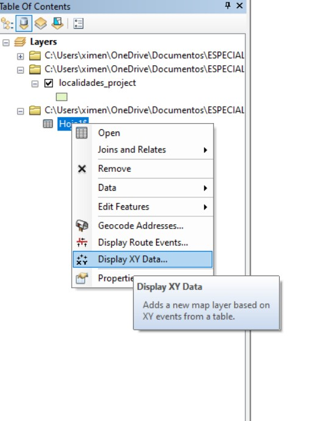
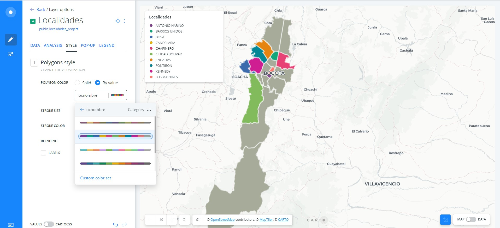

# TAREA 3- Publicación de mapas utilizando servicios en la nube

**Objetivos**

* Aplicar técnicas para el procesamiento, análisis y visualización de información georrefenciada para plantear la solución de un problema de interés.
* Entender y aplicar los procedimientos requeridos para realizar la publicación y visualización de datos geográficos en internet utilizando SaaS (Software as a Service).
* Aprovechar los elementos de interactividad proporcionados por las diferentes herramientas para la generación de aplicaciones que incorporan mapas.
* Narrar la solución dada al problema propuesto a través de una historia interactiva que involucre mapas y elementos multimedia.

**Entrega de resultados para revisión** 

* En el repositorio github personal creado para la clase crear una carpeta llamada Tarea_3
* Dentro de la carpeta Tarea_3 Crear un archivo Readme.md con los resultados de las actividades solicitadas.
* Una vez tenga los resultados publicados en github, crear un issue en 
https://github.com/dersteppenwolf/cartografia_web/issues con lo siguiente:
    
    ° Título: Tarea 3 - CODIGO_ESTUDIANTE
    ° Contenido: Enlace (URL) al archivo Readme.md dentro de la carpeta Tarea_3 publicado en el repositorio personal del curso.
     Ejemplo: https://github.com/dersteppenwolf/tareas_jc/blob/master/Tarea_1/README.md 

**Actividades**

**1. Definición del problema y fuentes de datos**

**Impacto Ambiental positivo que ha dejado el COVID- 19**

* Descripción del trabajo

La pandemia del coronavirus paradójicamente le ha generado un respiro al planeta. La reducción del número y la frecuencia de vuelos entre distintos destinos, así como el tráfico vehicular interno y el encierro obligado en el que se encuentran miles de personas en varias ciudades del mundo, han permitido que se reduza el nivel de emisiones de gases de efecto invernadero. 

* Describa de forma resumida el enfoque propuesto para el desarrollo del problema.

Para el desarrollo del problema, se cuentan con 1 capa de puntos que son las estaciones de calidad del aire, 

* Crear un boceto (mockup) donde se plantee la narrativa que se presentará al usuario e incluir cada una de las imágenes del mismo.

* Listado detallado de las fuentes de datos seleccionadas.

Capa | Descripción | Link
---|---|---
**Estaciones Calidad del aire**|Ubicación de las estaciones de la Red de Monitoreo de Calidad del Aire de Bogotá (RMCAB) para el área urbana del Distrito Capital, temáticamente  cuenta con el nombre de la estación de monitoreo que identifica el lugar donde se encuentra instalada, codificación, dirección, nombre de la entidad que permite la instalación de los equipos, altura de la estación snmm y altura de la estación con referencia al suelo, propósito de medición de la estación (Tráfico, fondo de la ciudad, de frontera, industrial) y si la estación está activa o inactiva| [https://www.datos.gov.co/Ambiente-y-Desarrollo-Sostenible/calidad-del-aire/7nmd-u7pq]
**Localidad. Bogotá D.C**|División política, administrativa y territorial municipal, con competencias claras y criterios de financiación y aplicación de recursos, creada por el Concejo Municipal a iniciativa del alcalde respectivo, con el fin de atender de manera más eficaz las necesidades de esa porción del territorio, cuenta con el nombre de cada localidad, localización y área.| [https://datosabiertos.bogota.gov.co/dataset/localidad-bogota-d-c]
**Temperatura Media Superficial**| Almacena las curvas de interpolación de la temperatura media superficial representada mediante un intervalo de temperatura medido en grados centigrados, y calculado para el periodo de reporte en el área urbana de Bogotá D.C,cuenta con  los valores de temperatura media superficial, periodo de medición (mensual, trimestral o anual) y año correspondiente al valor medido, así como el área de cada nivel de temperatura.| [http://visorgeo.ambientebogota.gov.co/?lon=-74.088081&lat=4.661300&z=11&l=5:1|84:1|12:1]
**Concentración de Material Particulado Inferior a 2.5 Micrómetros [PM 2.5] Promedio Mensual por Estación**| Contiene la concentración de Material Particulado inferior a 2.5 micras (PM2.5) anual por estación (Kennedy - Ken, Carvajal - Carv, Centro de Alto rendimiento - CdAR, Usaquén - Usaq, Fontibón - Fon, Puente Aranda - Puen, San Cristóbal - SanC, Tunal - Tunal, Guaymaral - Gua, Las Ferias - LFer, MinAmbiente - MinA, Suba - Suba) de la Red de Monitoreo de Calidad del Aire de Bogotá RMCAB.|[https://datosabiertos.bogota.gov.co/dataset/concentracion-de-material-particulado-inferior-a-2-5-micrometros-pm2-5-promedio-rmcab]
**Concentración de Material Particulado Inferior a 10 Micrómetros [PM 10] Promedio Mensual por Estación** | Contiene la concentraación de Material Particulado inferior a 10 micras (PM 10) anual por estación (Kennedy - Ken, Carvajal - Carv, Centro de Alto rendimiento - CdAR, Usaquén - Usaq, Fontibón - Fon, Puente Aranda - Puen, San Cristóbal - SanC, Tunal - Tunal, Guaymaral - Gua, Las Ferias - LFer, MinAmbiente - MinA, Suba - Suba) de la Red de Monitoreo de Calidad del Aire de Bogotá RMCAB. | https://datosabiertos.bogota.gov.co/dataset/concentracion-de-material-particulado-inferior-a-10-micrometros-pm10-promedio-mensual-por-estacion

https://datosabiertos.bogota.gov.co/dataset/temperatura-media-superficial-bogota-d-c

**2.Procesamiento de datos** 

 * Descripción detallada del procesamiento realizado a los datos (algoritmos, herramientas utilizadas, modelos, etc)

El procesamiento de la información empieza realizando la proyección a las capas que no cuentan con el sistema de referencia Magna Colombia Bogotá, a continuación se describe el proceso realizado a los datos para poder ser utilizados y de esta manera solucionar el problema planteado:

***Capa Localidades Bogotá** 

El shapefile de localidades para la ciudad de Bogotá, tiene como sistema de referencia el sistema WGS 1984, debido a que se trabajará con el sistema de referencia para la ciudad de Bogotá es necesario realizar la proyección mediante la herramienta Project 

Se realizó el mismo procedimiento para el shape Estaciones de calidad del aire. 

Seguido se realiza la tabulación de los datos de concentración material particulado inferior a 2.5 micrómetros (PM 2.5) y material particulado inferior a 10 micrómetros  (PM 10) que se obtuvieron filtrando aquellos que corresponden a los meses de Marzo, Abril y Mayo de los año 2019 y 2020, generando así un archivo de excel el cual contiene las coordenadas geográficas de las estaciones de la Red de Monitoreo de Calidad del aire ubicadas en  la ciudad de Bogotá.

Para realizar la conversión de las coordenadas  se usó el portal de herramientas Candensys, donde se llevan las coordenadas de latitud y longitud 

Las coordenadas son transformadas y posteriormnete reemplazadas en el archivo de excel 

A continuación, se espacilizan los puntos correspondientes a la ubicación de cada estación de calidad del aire. 

Posteriormente, con el propósito de representar gráficamente la dispersión de contaminantes en la ciudad de 
Bogotá durante el período de confinamiento y el año anterior se realiza una interpolación de las capas que contienen las cifras mensuales en μg/m3 de la concentración de contaminantes significativos como lo son Material Particulado Menor a 2.5 micras (PM2.5), el cual esta constituido por particulas muy pequeñas, producidas principalmente por los vehiculos pesados que utilizan diesel como combustible, y  que pueden transportar material muy peligroso para el cuerpo como metales pesados, compuestos orgánicos y virus.

**3.CARTO**

* Cree un tablero de control utilizando Carto (https://carto.com/) buscando soportar la historia a contar dentro de la narrativa propuesta.

  * Datos:

Capa | Atributos Principales 
---|---
**Estaciones Red Calidad aire**: Categórica | Nombre de la estación, Ubicación
**Localidades**: Categórica | Nombre de la localidad 
**Concentración de Ozono Promedio Mensual**: Geometría tipo poligono | Promedio concentración de ozono 

DEBO REALIZAR EL MOCKUP- DONDE SE INTERACTUE CON UN MAPA Y LAS VARIABLES (CATEGORICAS) 

* Describir de forma detallada el procedimiento utilizado para publicar la aplicación.

Para publicar en CARTO primero se cargó el conjunto de datos a utilizar > *New Dataset* 

> En la pestaña *Upload* se busca el shapefile que se va a subir a la plataforma 

Se puede observar la vista de los atributos del shape que se acaba de cargar

Podemos hacer el preview de las geometrías y seguidamente crear un mapa 

Donde se puede cambiar el estilo del Basemap, aplicar simbología al mapa, crear leyenda y ventanas emergentes, para cada una de las capas que se han cargado. 

Se selecciona la capa con la cual se va a trabajar, en la pestaña *Style* > *By value* se selecciona el atributo que va a ser representado por medio de la simbología, en este caso el nombre de la localidad (locnombre)

Seguido en la pestaña Legend se inserta la leyenda de tipo categórico para la capa de localidades 

En la pestaña Pop-Up se habilitó la ventana emergente y se seleccionan los atributos de la capa que se quieren mostrar

* Describir método utilizado para clasificar los datos.

* Describir el criterio para la selección de los colores a utilizar en la simbología

El criterio que usado para seleccionar la simbología fue categórico puesto que el atributo seleccionado (locnombre) describe un conjunto de entidades con el mismo valor de atributo. 

* Incluir url en línea al tablero de control publicado. Ejemplo: https://gkudos.carto.com/u/kudosg/builder/501b7abf-3809-41e7-a71b-39223fb3dbbf/embed

